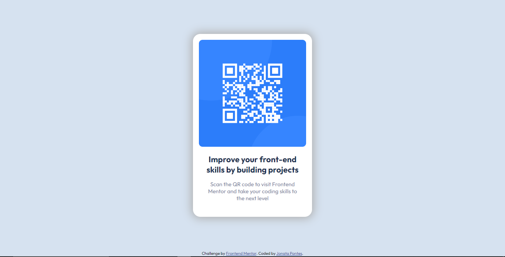

# Frontend Mentor - QR code component solution

This is a solution to the [QR code component challenge on Frontend Mentor](https://www.frontendmentor.io/challenges/qr-code-component-iux_sIO_H). Frontend Mentor challenges help you improve your coding skills by building realistic projects. 

## Table of contents

- [Overview](#overview)
  - [Screenshot](#screenshot)
  - [Links](#links)
- [My process](#my-process)
  - [Built with](#built-with)
- [Author](#author)
- [Acknowledgments](#acknowledgments)

## Overview

### Screenshot

### Links

- Solution URL: [Add solution URL here](https://github.com/jonatapontesdev/qr-code)
- Live Site URL: [Add live site URL here](https://jonatapontesdev.github.io/qr-code/)

## My process

### Built with

- Semantic HTML5 markup
- CSS custom properties
- Flexbox
- CSS Grid
- Mobile-first workflo

## Author

- Website - [Jonata Pontes](https://github.com/jonatapontesdev)
- Frontend Mentor - [@jonatapontesdev](https://www.frontendmentor.io/profile/jonatapontesdev)
- Instagram - [@jonataoontesss](https://instagram.com/jonatapontesss)

## Acknowledgments

I thank my wife, for always believing in my potential and insisting on my ability. I also thank my friends and colleagues for encouraging me to grow in my field.